<div align="center">



<br/>

[](https://sathis.dev)

<br/>

<a href="https://sathis.dev"></a>
<a href="https://www.linkedin.com/in/sathis-hettiarachchi-52b4b436a/"></a>
<a href="mailto:sathis.rc.dev@gmail.com"></a>
<a href="https://github.com/sathis-dev"></a>

<br/>


</div>

---

## `$ cat about_me.ts`

```typescript
interface Developer {
  name:       string;
  role:       string;
  location:   string;
  education:  string;
  focus:      string[];
  building:   string;
  openTo:     string[];
}

const sathis: Developer = {
  name:       "Sathis Hettiarachchi",
  role:       "Full-Stack Developer",
  location:   "Cambridge, United Kingdom 🇬🇧",
  education:  "BTEC L3 Computing",
  focus:      ["Web Performance", "UI/UX Excellence", "Scalable APIs", "IoT"],
  building:   "Production web apps with Next.js 16 & React 19",
  openTo:     ["Full-time roles", "Freelance", "Collaborations"],
};

// Available for hire ✅
export default sathis;
```

<br/>

---

## `$ ls tech_stack/`

<div align="center">

<table>
<tr>
<td align="center" width="33%">

**🎨 Frontend**

<a href="https://skillicons.dev"></a>
<a href="https://skillicons.dev"></a>

`Framer Motion` · `Zod` · `React Hook Form`

</td>
<td align="center" width="33%">

**⚙️ Backend & DB**

<a href="https://skillicons.dev"></a>
<a href="https://skillicons.dev"></a>

`REST APIs` · `JWT Auth` · `WebSockets`

</td>
<td align="center" width="33%">

**🛠️ DevOps & Tools**

<a href="https://skillicons.dev"></a>
<a href="https://skillicons.dev"></a>

`CI/CD` · `GitHub Actions` · `Nginx`

</td>
</tr>
</table>

</div>

<br/>

---

## `$ github --stats`

<div align="center">


&nbsp;


<br/>


</div>

<br/>

---

## `$ cat contribution_graph.log`

<div align="center">

<picture>
  <source media="(prefers-color-scheme: dark)"
    srcset="https://github-readme-activity-graph.vercel.app/graph?username=sathis-dev&bg_color=0D1117&color=6EE7B7&line=6EE7B7&point=ffffff&area=true&hide_border=true&area_color=6EE7B720&custom_title=Contribution+Activity"/>
  
</picture>

</div>

<br/>

---

## `$ ls projects/featured/`

<div align="center">

<a href="https://github.com/sathis-dev/my-portfolio-website">
  
</a>
&nbsp;
<a href="https://github.com/sathis-dev/silent-help">
  
</a>

</div>

<br/>

---

## `$ cat values.md`

<div align="center">

<table>
<tr>
<td align="center" width="25%">

**🏗️ Clean Architecture**
<br/>
<sub>Structured, maintainable code with clear separation of concerns</sub>

</td>
<td align="center" width="25%">

**⚡ Performance First**
<br/>
<sub>Lighthouse 95+ scores, optimized bundles, edge-ready</sub>

</td>
<td align="center" width="25%">

**📱 Responsive Design**
<br/>
<sub>Mobile-first, pixel-perfect across all devices</sub>

</td>
<td align="center" width="25%">

**🤝 Team Player**
<br/>
<sub>Agile workflow, clear PRs, thorough code reviews</sub>

</td>
</tr>
</table>

</div>

<br/>

---

## `$ ./contact.sh`

<div align="center">

```bash
#!/bin/bash
# ⚡ The fastest way to reach me

echo "📧 Email:     sathis.rc.dev@gmail.com"
echo "🌐 Portfolio: https://sathis.dev"
echo "💼 LinkedIn:  linkedin.com/in/sathis-hettiarachchi-52b4b436a"
echo "📍 Location:  Cambridge, UK"
echo ""
echo "✅ Status:    OPEN TO OPPORTUNITIES"
echo "⚡ Response:  Within 24 hours"
```

<br/>

<a href="mailto:sathis.rc.dev@gmail.com"></a>
&nbsp;
<a href="https://sathis.dev"></a>
&nbsp;
<a href="https://www.linkedin.com/in/sathis-hettiarachchi-52b4b436a/"></a>

<br/><br/>

> *"First, solve the problem. Then, write the code."* — John Johnson

<br/>


</div>
